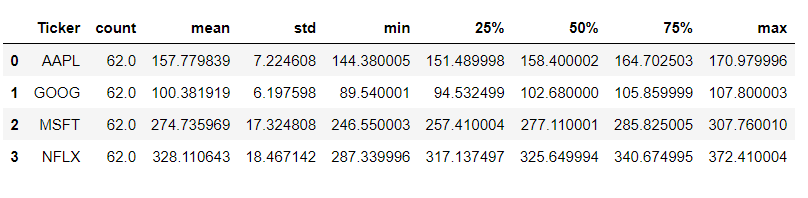
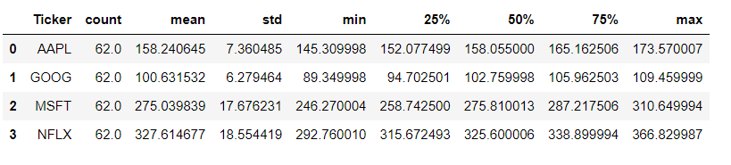
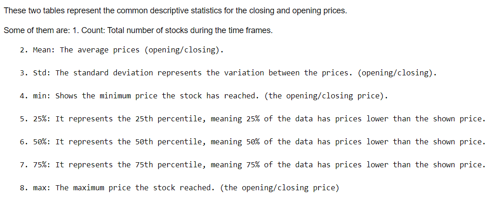
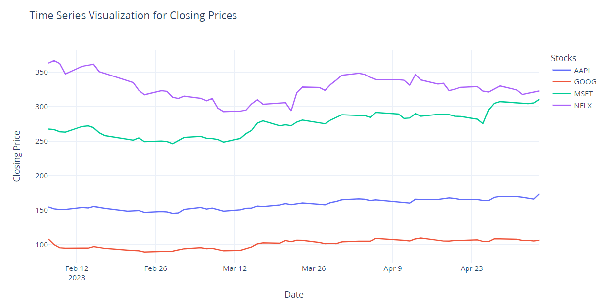
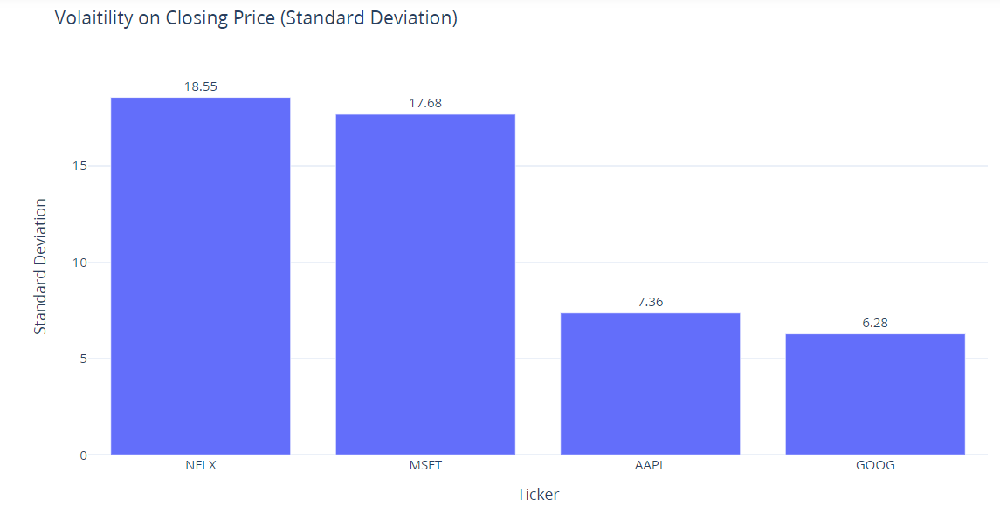
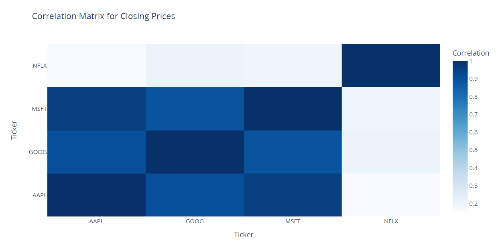
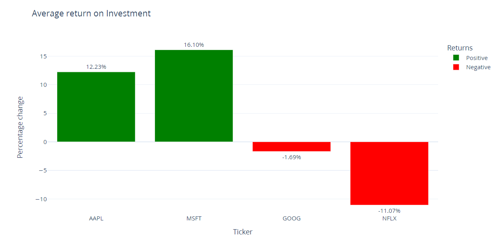
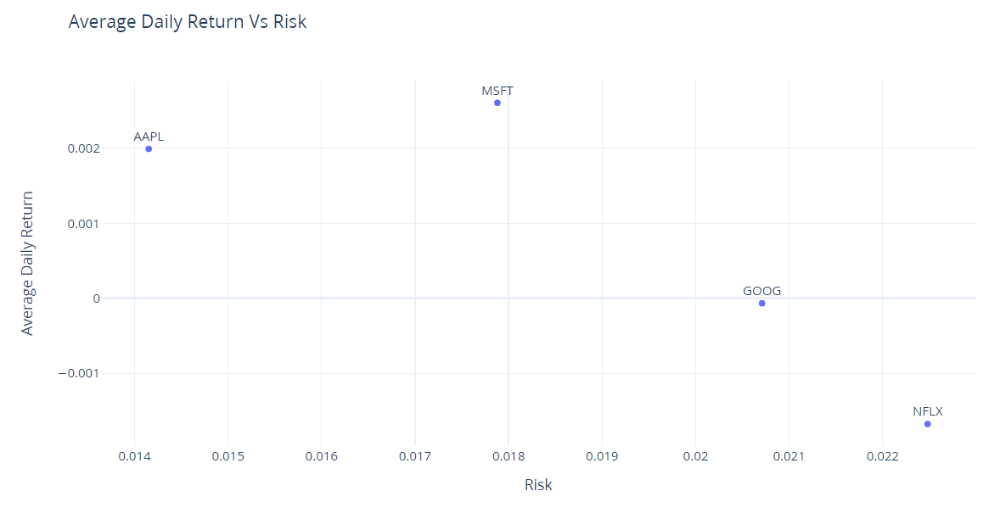

## Quantitative Analysis of Stock Market using Python

 Here, we wil be analyzing the top 4 stocks (Apple, Microsoft, Google, and Netflix) using Python.

#### 1. Descriptive Statistics:

Descriptive Statistics for the Opening price:

Descriptive Statistics for the Closing price:

A brief description about the estimates:

#### 2. Time Series Analysis:

From the above chart we can see that, MSFT and AAPL has a general upward trend in the closing price.

#### 3. Volatility Analysis:

Now, we will analyze how much volatile are the stocks for the closing prices using standard deviation i.e. how much do these stocks deviate from their closing mean price.

From this bar chart, we can see that NFLX(18.55) and MSFT(17.68) are the most volatile stocks compared to AAPL(7.36) and GOOG(6.28).

#### 4. Correlation Analysis:

Now, let's see if there is any kinds of correlation among these stocks in their closing price.

- Values that are close to +1 represents a strong correlation.
- Values that are close to -1 represents a negative correlation.
- Values close to 0 shows to correlation.

Here, GOOG and AAPL has a strong positive correlation with 0.901. Which means, if the closing price of AAPL is high,GOOG also tends to have a higher closing price and vice versa.

#### 5. Comparative Analysis:

Here, we will compare the performance of different stocks based on their returns over the period.We will calculate the percentage change in closing prices from start to the end of the period of each stock.

Here, the highest positive return is from the MSFT with 16.10 % while NFLX has the lowest return with -11.07 %.

#### 6. Daily Risk Vs Return Analysis:

Here, we will calculate the average daily returns based on closing price and then calculate the
standard deviation of daily returns for each of the stock.
The standard deviation will represent the risk i.e. how much does the stock fluctuates on a daily basis and 
the average daily return represents how much can we expect the stocks to give us in return.

Here, NFLX has the highest risk yet negative return, while AAPL has the lowest risk and highest return.
Similarly, MSFT has an average risk but the has the highest return out of all and finally,
GOOG has the second highest risk after NFLX and second lowest return on average a slightly negative return after NFLX.

So, AAPL seems to be the best investment option and then MSFT.
